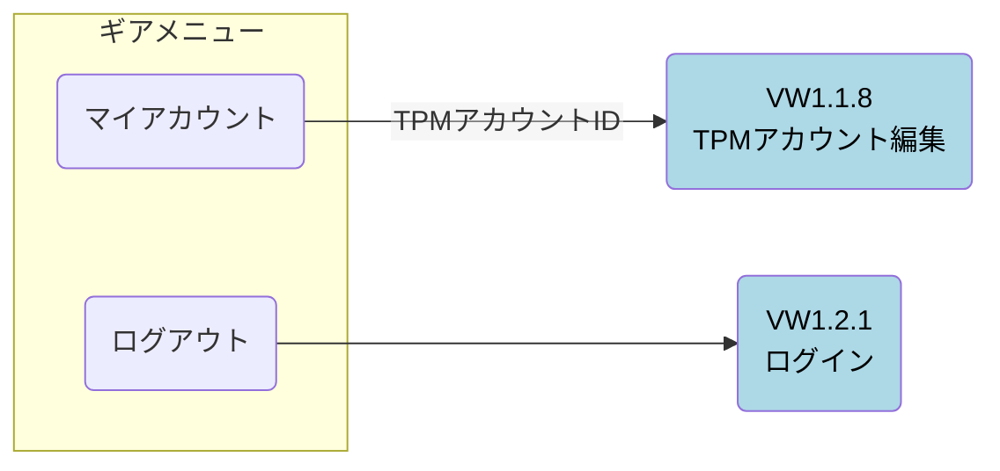

# TPM管理（ギアメニュー）

```mermaid
%%{init: {"flowchart": {"htmlLabels": false}} }%%
flowchart LR;
    %% スタイル定義
    classDef screenFlame fill:lightBlue, color:black;

    %% 画面定義
    myaccount("マイアカウント");
    logout("ログアウト");
    tpm_acc_edit("VW1.1.8\nTPMアカウント編集");
    tpm_login("VW1.2.1\nログイン");

    subgraph ギアメニュー
        myaccount;
        logout;
    end

    %% 画面遷移図
    myaccount -- "TPMアカウントID" --> tpm_acc_edit;
    logout --> tpm_login;

    class tpm_acc_edit,tpm_login screenFlame;
```
