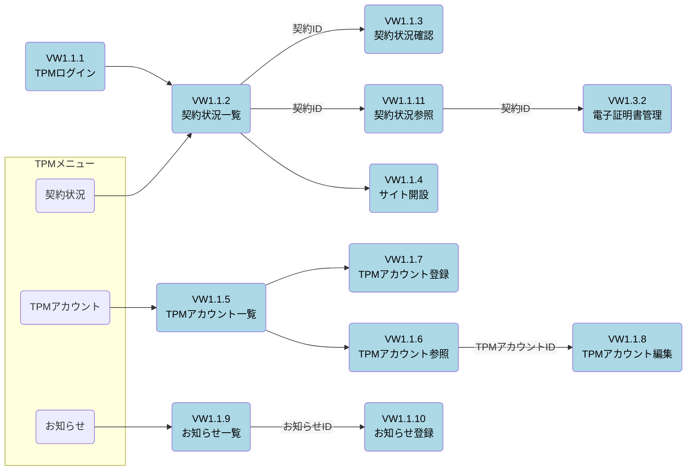

# TPM管理メニュー

```mermaid
%%{init: {"flowchart": {"htmlLabels": false}} }%%
flowchart LR;

    %% スタイル定義
    classDef screenFlame fill:lightBlue, color:black;  

    %% 画面遷移図
    tpm_login("VW1.1.1\nTPMログイン");
    tpm_login --> contract_list;

    contract_state_tab("契約状況") --> contract_list;
    tpm_account_tab("TPMアカウント")  --> tpm_acc_list;
    notice_tab("お知らせ") --> notice_list;
    subgraph TPMメニュー
        contract_state_tab;
        tpm_account_tab;
        notice_tab;
    end

    %% -契約状況
    contract_list("VW1.1.2\n契約状況一覧");
    contract_edit("VW1.1.3\n契約状況確認");
    contract_view("VW1.1.11\n契約状況参照");
    cert_manager("VW1.3.2\n電子証明書管理");
    site_open("VW1.1.4\nサイト開設");

    contract_list -- "契約ID" --> contract_edit;
    contract_list -- "契約ID" --> contract_view;
    contract_list --> site_open;
    contract_view -- "契約ID" --> cert_manager;

    %% -TPMアカウント
    tpm_acc_list("VW1.1.5\nTPMアカウント一覧");
    tpm_acc_register("VW1.1.7\nTPMアカウント登録");
    tpm_acc_edit("VW1.1.8\nTPMアカウント編集");
    tpm_acc_view("VW1.1.6\nTPMアカウント参照");

    tpm_acc_list --> tpm_acc_register;
    tpm_acc_list --> tpm_acc_view;
    tpm_acc_view -- "TPMアカウントID" --> tpm_acc_edit;

    %% -お知らせ
    notice_list("VW1.1.9\nお知らせ一覧");
    notice_register("VW1.1.10\nお知らせ登録");
    
    notice_list -- "お知らせID" --> notice_register;

    class tpm_menu blueFlame;
    class tpm_login alreadyScreenFlame;
    class tpm_login,contract_list,contract_edit,contract_view,site_open,cert_manager,tpm_acc_list,tpm_acc_register,tpm_acc_edit,tpm_acc_view,notice_list,notice_register screenFlame;
```
